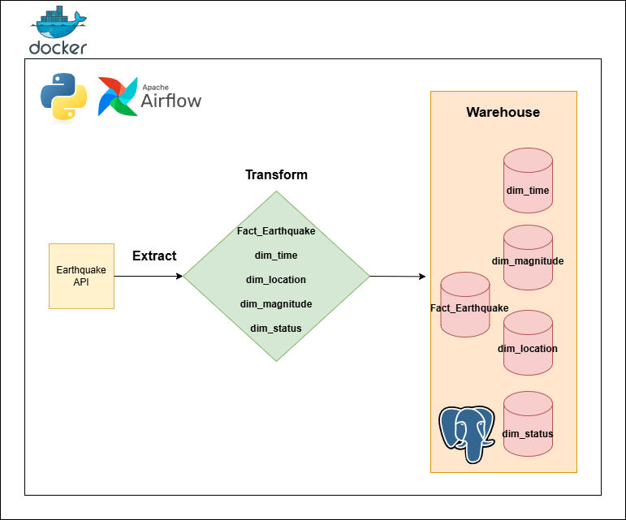
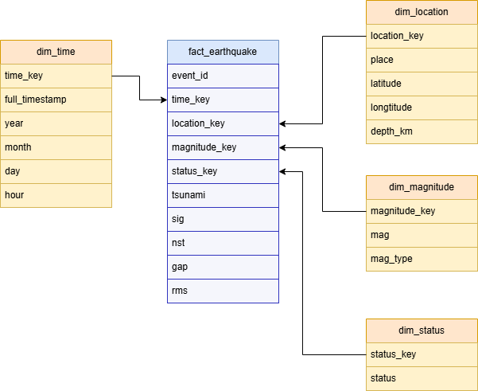

# **Earthquake Data Pipeline**
![Version][Version-Shield]

Earthquake Data Pipeline was a data engineering system to fetching, transforming, and saving all earthquake data around all the coutries. This data using ETL method to ingest data from realtime Earthquake API. 

# **Purpose**
This project was initiated to bring some purposes, including **:**
* Provide real time data of earthquake around the world for all stakeholders (including National Search and Rescue Agency)
* Being my personal data engineering project

# **🛠️ Tech Stacks**
* [![Docker][Docker-Logo]][Docker-Url]
* [![Apache Airflow][Apache-Airflow-Logo]][Apache-Airflow-Url]
* [![Python][Python-Logo]][Python-Url]
* [![Postgres][Postgres-Logo]][Postgres-Url]

# **🔁 Data Pipeline Flow**

# **⭐ Data Pipeline Star Schema**

<!--Markdown Links & Images-->
<!--Url-->
[Docker-Url]:https://www.docker.com/
[Apache-Airflow-Url]:https://airflow.apache.org/
[Python-Url]:https://www.python.org/
[Postgres-Url]:https://www.postgresql.org/
[Version-Url]:https://github.com/ibrahimkuranglebih/earthquake-data-pipeline?tab=readme-ov-file
<!--Logo-->
[Docker-Logo]:https://img.shields.io/badge/Docker-blue?logo=docker&logoColor=ffffff
[Apache-Airflow-Logo]:https://img.shields.io/badge/Apache_Airflow-017CEE?logo=apacheairflow&logoColor=ffffff
[Python-Logo]:https://img.shields.io/badge/Python-FBEF76?logo=python&logoColor=ffffff
[Postgres-Logo]:https://img.shields.io/badge/Postgres-4169E1?logo=postgresql&logoColor=ffffff
[Version-Shield]:https://img.shields.io/badge/Version-1.0-blue